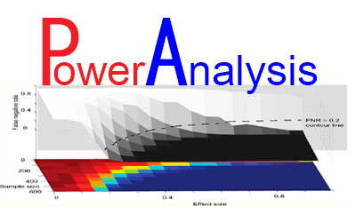

# Statistical Power Analysis tool
Version: 1.0

## Short Description

Estimation of statistical power and sample size in metabolic phenotyping.

## Description

Statistical power analysis tool

This is a Python tool to help you design your experiment in order to gain your expected power with combination of effect and sample size for multivariate data sets.

This tool can only run in Python 2.x.


## Key features

- Statistical Power Analysis
- Experiment Design

## Functionality

- Statistical Power Analysis
- Random Permutation
- False Discovery Rate (by Benjamini & Hochberg)

## Approaches

- Metabolomics / Targeted

## Instrument Data Types

- ALL

## Screenshots


## Tool Authors

- Goncalo Correia (Imperial College London)
- Jianliang Gao (Imperial College London)

## Container Contributors

- [Jianliang Gao](https://github.com/jianlianggao) (Imperial College London)

## Website

- http://pubs.acs.org/doi/abs/10.1021/acs.analchem.6b00188


## Git Repository

- https://github.com/jianlianggao/papy

## Installation 

For local individual installation:

```bash
docker pull docker-registry.phenomenal-h2020.eu/phnmnl/papy:latest
```

## Usage Instructions

For direct docker usage:

```bash
docker run docker-registry.phenomenal-h2020.eu/phnmnl/papy ...
```

## Help and Documentation

Please check the "docs" folder for detail. 

## Publications

- Benjamin, J. Blaise, Goncalo Correia, et al., Power Analysis and Sample Size Determination in Metabolic Phenotyping. Bioinformatics, 2016. 88(10): p. 5179-5188.
DOI: 10.1021/acs.analchem.6b00188
